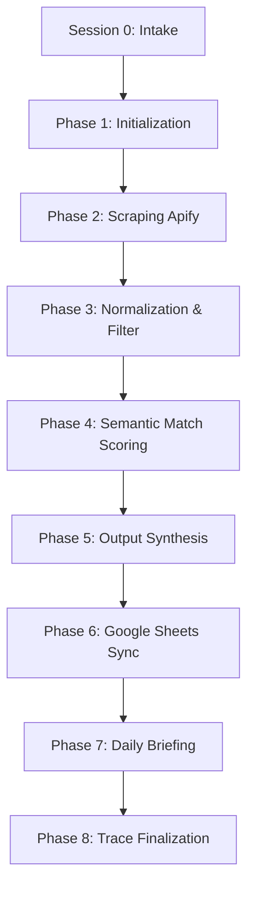

# APEX — Autonomous Placement & Execution Agent

APEX is a Tier-1 Autonomous Career Intelligence system designed to scrape live job postings via Apify, run semantic scoring against a candidate profile, generate resume optimization tips and personalized cold outreach strategies, and sync target jobs directly to a Google Sheets dashboard.

---

## 1. Directory Architecture

```
APEX/
│
├── config/
│   ├── user_profile.json          # Master candidate profile (skills, roles, preferences)
│   ├── search_parameters.json     # Active job search filters (roles, locations, work modes)
│   ├── apify_config.json          # Apify actor IDs, API tokens, timeouts
│   ├── gdrive_config.json         # Google Drive folder/Sheet IDs, auth configurations
│   └── scoring_weights.json       # WMDSS config (skills, roles, salary, experience weights)
│
├── master_data/
│   ├── resume_master.md           # Master candidate resume (source of truth)
│   ├── skills_taxonomy.json       # Mapping from tech aliases to canonical skills
│   ├── company_blocklist.txt      # Companies excluded from results
│   └── preferred_companies.txt    # Dreaming/priority companies marked for highlight
│
├── scraped_data/                  # Auto-generated scraped records
│   ├── raw/                       # Immutable raw JSON payloads from Apify actors
│   ├── normalized/                # Schema-validated, cleaned, and parsed records
│   └── archive/                   # Rotated archival data (90-day TTL)
│
├── output/                        # Deliverables generated by the pipeline
│   ├── daily_report/              # Human-readable markdown reports (summary metrics & jobs list)
│   ├── tailored_resumes/          # Tailoring guidelines tailored to specific jobs
│   └── outreach_scripts/          # Auto-generated recruiter outreach messages
│
├── logs/                          # System logs and audit trials
│   ├── execution_trace.log        # Main pipeline execution trace
│   ├── error_log.log              # Failure events and data-gap interrupts
│   └── dedup_log.log              # Log of duplicate job entries rejected
│
└── gdrive_sync/
    └── sync_manifest.json         # Google Sheets sync tracking metrics
```

---

## 2. Key Components & Config Files

* **Candidate Settings:**
  * [config/user_profile.json](APEX/config/user_profile.json): Holds core professional profiles, target salary, and cities.
  * [config/search_parameters.json](APEX/config/search_parameters.json): Scraper search terms, location, and work modes.
  * [config/scoring_weights.json](APEX/config/scoring_weights.json): Defines mathematical weights for semantic alignment scoring. Must sum to exactly 1.00.
* **Integrations:**
  * [config/apify_config.json](APEX/config/apify_config.json): Mapping of platform scrapers and API tokens.
  * [config/gdrive_config.json](APEX/config/gdrive_config.json): Google Sheet and Drive IDs, OAuth config scopes.
* **Sources of Truth:**
  * [master_data/resume_master.md](APEX/master_data/resume_master.md): Read-only canonical Markdown resume.
  * [master_data/skills_taxonomy.json](APEX/master_data/skills_taxonomy.json): Synonyms mapping list.
* **Telemetry & Tracking:**
  * [gdrive_sync/sync_manifest.json](APEX/gdrive_sync/sync_manifest.json): Prevent writing duplicated jobs back to Google Sheets.
  * [logs/execution_trace.log](APEX/logs/execution_trace.log): Tracks step durations, success metrics, and process telemetry.

---

## 3. Cognitive Pipeline stages



1. **Session 0: Intake & Onboarding** — Triggered on first-time setup or user reset. Populates configs.
2. **Phase 1: Init & State Validation** — Ensures all configs match expectations, checks run logs.
3. **Phase 2: Scrape Job Postings** — Fires parallel Apify actors for platforms (LinkedIn, Naukri, etc.).
4. **Phase 3: Clean & Filter** — Normalizes salaries, checks blocklisted companies, isolates must-have skills.
5. **Phase 4: WMDSS Scoring** — Computes match score and categorizes jobs into Tiers (1 to 5).
6. **Phase 5: Output Synthesis** — Crafts custom resume guidelines, outreach emails, and competition signals.
7. **Phase 6: Google Sheets Write** — Deduplicates via SHA256 URL hashes, appends new rows.
8. **Phase 7: Daily Briefing** — Outputs a markdown dashboard file in [output/daily_report/](APEX/output/daily_report).
9. **Phase 8: Execution Trace** — Emits execution trace, runtime analytics, and logs.

---

## 4. Documentation

For setup instructions and runtime instructions, refer to the [user_manual.md](APEX/user_manual.md).
For python dependencies, refer to the [requirements.txt](APEX/requirements.txt).
